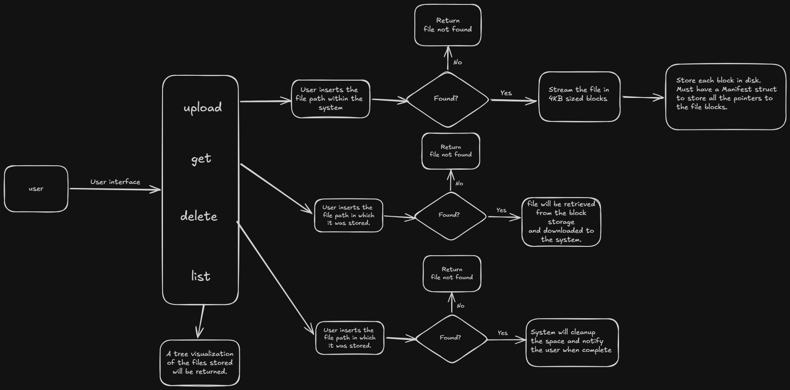
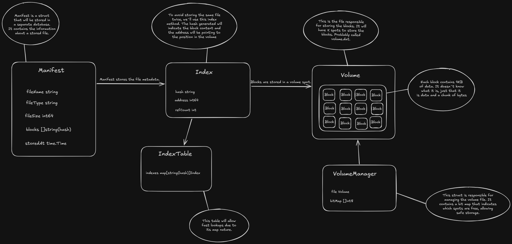

## TOJALB3

While taking the AWS Certified Cloud Practioner course, I was presented to three storage concepts: Block, File and Object. I could understand the 
File and Object ones, but the Block Storage was a little confusing to me. So I had an idea: why not try and implement one myself (not at the same level as the Amazon one, but the same fundamentals and logic behind it)? Following this, i started this project.

The goal is to implement a Block Storage Engine Inode with a CLI interface allowing the user to upload, delete, get and list files. The file uploaded
by the user will be cut into pieces (4KB per piece), and each piece will occupy a spot in the volume file. Each block (piece) is different from the
other, not allowing duplicates. This will be possible by creating a hash for each block using SHA-256, because it creates a hash based on the file
contents. Following the upload, we need to create something called a manifest. The manifest is responsible for holding the metadata from the original 
file. We will use this manifest to make lookups, retrieve and delete files.

# HIGH LEVEL DIAGRAM

This is a top level overview of the interaction between user/software and the minimized logic flow of the operations.

# ARCHITECTURAL DIAGRAM

This is a more in-depth representation containing the main structs/classes that allow the operation.
